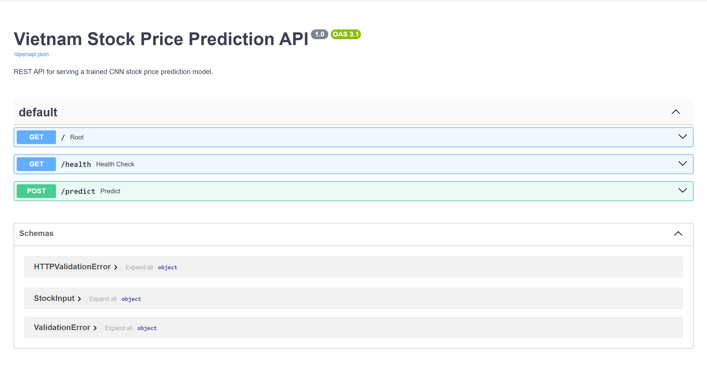

# Deep Learning for Artificial Intelligence Final Project

# Intelligent Stock Market Forecasting, Trading Signal Identification, and Portfolio Optimization using Deep Learning


---

# Project Overview

This project was developed as the final project for the course **Deep Learning for Artificial Intelligence**.

The project applies deep learning techniques to financial time-series forecasting using both Nasdaq and Vietnam stock market datasets. The system investigates how deep learning models can support practical financial analysis tasks, including:

- stock price prediction,
- trading signal identification,
- portfolio construction,
- risk analysis,
- and lightweight AI deployment.

The project combines:
- time-series forecasting,
- deep learning experimentation,
- classification modeling,
- portfolio management logic,
- API deployment,
- and SaaS-style frontend engineering.

Two major deep learning architectures were explored:
- Convolutional Neural Networks (CNN)
- Long Short-Term Memory Networks (LSTM)

The final system includes:
- forecasting notebooks,
- trading signal classifiers,
- portfolio optimization modules,
- FastAPI deployment,
- and a Streamlit SaaS-style interface.

---

# Project Objectives

The main objectives of this project are:

1. Develop deep learning models capable of predicting future stock prices.
2. Compare CNN and LSTM architectures for financial forecasting.
3. Identify buy and sell trading signals.
4. Build a simplified portfolio optimization framework.
5. Deploy trained models using modern AI engineering tools.
6. Demonstrate an end-to-end practical AI workflow.

---

# Demo

## FastAPI Swagger API Documentation

```text
http://127.0.0.1:8000/docs
```

## Run Streamlit SaaS Application

```bash
python -m streamlit run streamlit_app.py
```

The SaaS application supports:
- stock prediction,
- prediction visualization,
- API communication,
- prediction monitoring,
- and portfolio analysis visualization.

---

# Application Screenshots

## FastAPI Swagger Documentation



---

## Streamlit SaaS Dashboard


---

## Prediction Example


---

# Reproducibility

All figures, tables, metrics, and evaluation outputs are dynamically generated from the notebooks and stored inside the `results/` directory.

When the notebooks are rerun, the project automatically regenerates:
- forecasting metrics,
- classification metrics,
- portfolio outputs,
- plots,
- and deployment artifacts.

This improves reproducibility and experimentation consistency.

---

# Datasets

The project uses two main datasets.

---

## 1. Nasdaq Historical Stock Dataset

Used for:
- Task 1 forecasting experiments,
- CNN vs LSTM comparison,
- multi-step forecasting analysis.

Features included:
- Open
- High
- Low
- Close
- Adjusted Close
- Volume

---

## 2. Vietnam Stock Market Dataset

Used for:
- Vietnam stock forecasting,
- trading signal identification,
- portfolio optimization,
- deployment demonstration.

Selected Vietnam stocks:
- FPT
- VCB
- VNM
- HPG
- MBB

Features included:
- Open
- High
- Low
- Close
- Volume
- TradingDate

---

# Repository Structure

```text
DL_Final_Project/
│
├── app/
│   ├── api.py
│   ├── streamlit_app.py
│   └── workflow_description.md
│
├── data/
│   ├── nasdaq/
│   └── vietnam/
│
├── notebooks/
│   ├── 01_data_exploration.ipynb
│   ├── 02_task1_cnn_prediction.ipynb
│   ├── 03_lstm_prediction.ipynb
│   ├── 04_model_comparison.ipynb
│   ├── 05_task2_vietnam_prediction.ipynb
│   ├── 06_task3_trading_signal.ipynb
│   ├── 07_task4_portfolio_risk.ipynb
│   └── 08_final_results_summary.ipynb
│
├── models/
│
├── results/
│   ├── figures/
│   ├── metrics/
│   └── tables/
│
├── saved_objects/
│
├── report/
│
├── requirements.txt
├── README.md
└── .gitignore
```

---

# AI Engineering Workflow

```text
Raw Stock Data
      ↓
Data Cleaning
      ↓
Feature Engineering
      ↓
Normalization
      ↓
Sliding Window Generation
      ↓
CNN / LSTM Training
      ↓
Model Evaluation
      ↓
Saved .keras Model
      ↓
FastAPI Deployment
      ↓
Streamlit SaaS Application
      ↓
User Prediction
```

This workflow demonstrates a simplified end-to-end AI engineering pipeline inspired by modern machine learning deployment systems.

---

# Methodology

## 1. Data Preprocessing

The preprocessing pipeline includes:
- missing value handling,
- chronological sorting,
- feature selection,
- MinMax normalization,
- and time-window sequence generation.

A sliding window approach was used:
- input window size: 30 trading days,
- forecasting targets:
  - next-day prediction,
  - kth-day prediction,
  - multi-step prediction.

---

## 2. Time-Series Splitting

The dataset was split chronologically to avoid future information leakage.

Split ratio:
- Training set: 70%
- Validation set: 15%
- Test set: 15%

Random shuffling was intentionally avoided because stock market data is sequential.

---

## 3. Deep Learning Models

### CNN Architecture

The CNN architecture includes:
- Conv1D layers,
- MaxPooling1D,
- Dropout regularization,
- Dense fully connected layers.

CNN was selected because it efficiently captures local temporal patterns from stock market sequences.

---

### LSTM Architecture

LSTM models were implemented for:
- kth-day forecasting,
- multi-step forecasting.

LSTM networks are designed to capture longer temporal dependencies in sequential data.

---

## 4. Technical Indicators

For trading signal identification, the following financial indicators were engineered:
- SMA
- EMA
- MACD
- RSI
- Volatility
- Daily Return

These indicators help the model learn:
- market momentum,
- trend direction,
- and market stability.

---

# Model Performance Summary

| Task | Best Model | Key Result |
|---|---|---|
| Task 1.1 | CNN | Strong next-day forecasting |
| Task 1.2 | LSTM | Better long-horizon forecasting |
| Task 1.3 | CNN | More stable multi-step forecasting |
| Task 2 | CNN | Effective Vietnam stock forecasting |
| Task 3 | CNN Classifier | Trading signal classification |
| Task 4 | Portfolio Framework | Risk-aware portfolio allocation |

---

# Task 1 — Nasdaq Stock Forecasting

Task 1 focuses on forecasting Nasdaq stock prices using deep learning models.

Implemented forecasting scenarios:
1. Next-day prediction
2. kth-day prediction
3. Multi-step prediction

Key findings:
- CNN performed strongly in next-day and multi-step forecasting.
- LSTM performed better in some long-horizon forecasting tasks.
- Forecasting error increased as prediction horizon increased.

---

# Task 2 — Vietnam Stock Market Forecasting

Task 2 extends the forecasting pipeline to Vietnam stock market data.

Multi-feature inputs:
- Low
- Open
- Volume
- High
- Close

## Task 2 Results

| Task | RMSE | MAE |
|---|---|---|
| Task 2.1 — Next-day prediction | 0.0361 | 0.0276 |
| Task 2.2 — 7th-day prediction | 0.0494 | 0.0369 |
| Task 2.3 — Next 7 days prediction | 0.0730 | 0.0594 |

Key observations:
- forecasting error increased with longer prediction horizons,
- CNN generalized effectively on Vietnam market data,
- multi-step forecasting remained significantly more difficult.

---

# Task 3 — Trading Signal Identification

Task 3 reformulates stock analysis as a classification problem.

The models identify:
- Buy signals
- Sell signals

based on future return thresholds.

## Buy Signal Identification

| Metric | Value |
|---|---|
| Accuracy | 0.5050 |
| Precision | 0.4885 |
| Recall | 0.9717 |
| F1-score | 0.6501 |

Observation:
- the buy model achieved strong recall,
- but produced many false positives.

---

## Sell Signal Identification

| Metric | Value |
|---|---|
| Accuracy | 0.6672 |
| Precision | 0.3056 |
| Recall | 0.3077 |
| F1-score | 0.3066 |

Observation:
- sell signal classification was significantly more difficult,
- mainly due to class imbalance and fewer downward movements.

---

# Task 4 — Portfolio Optimization and Risk Management

Task 4 combines profitability analysis and risk management.

The framework evaluates:
- cumulative return,
- average daily return,
- volatility,
- maximum drawdown.

## Final Portfolio Allocation

| Stock | Allocation |
|---|---|
| VNM | 39.93% |
| VCB | 35.49% |
| FPT | 24.57% |

Portfolio interpretation:
- VNM provided defensive low-risk characteristics,
- VCB provided stronger growth potential,
- FPT improved diversification.

---

# Task 5 — Deployment and AI Engineering Workflow

## FastAPI Deployment

A lightweight REST API was developed using FastAPI.

The API:
- loads trained TensorFlow models,
- receives JSON requests,
- returns prediction outputs.

Swagger documentation is available at:

```text
http://127.0.0.1:8000/docs
```

---

## Streamlit SaaS Application

A Streamlit web application was developed to simulate a lightweight SaaS interface.

Features include:
- interactive prediction requests,
- configurable stock inputs,
- prediction visualization,
- prediction interpretation,
- API communication,
- prediction history tracking.

---

## AI Workflow Design

The project demonstrates a simplified AI engineering workflow including:
- data preprocessing,
- feature engineering,
- model training,
- model evaluation,
- model serialization,
- API deployment,
- and frontend integration.

This workflow demonstrates how deep learning systems can be transformed into deployable AI applications.

---

# Environment Setup

## 1. Create Virtual Environment

```bash
python -m venv venv
```

---

## 2. Activate Environment

### Windows

```bash
venv\Scripts\activate
```

### Mac/Linux

```bash
source venv/bin/activate
```

---

## 3. Install Dependencies

```bash
pip install -r requirements.txt
```

---

# Running the Application

## Run FastAPI Backend

```bash
cd app
python -m uvicorn api:app --reload
```

---

## Run Streamlit Frontend

```bash
cd app
python -m streamlit run streamlit_app.py
```

---

# Key Technologies Used

- Python
- TensorFlow / Keras
- NumPy
- Pandas
- Matplotlib
- Scikit-learn
- FastAPI
- Streamlit

---

# Limitations

Several limitations remain in this project:

- Financial markets are highly noisy and difficult to predict.
- Only historical market features were used.
- Macroeconomic indicators and news sentiment were excluded.
- Portfolio optimization was simplified.
- Real trading constraints such as transaction cost were not modeled.

---

# Future Improvements

Future extensions may include:
- Transformer-based forecasting models,
- reinforcement learning trading agents,
- real-time stock streaming,
- SQL/MongoDB integration,
- Airflow automation pipelines,
- Docker containerization,
- cloud deployment,
- automated retraining systems,
- sentiment analysis integration.

---

# Conclusion

This project demonstrates how deep learning can be applied to financial market analysis through:
- forecasting,
- classification,
- portfolio management,
- deployment,
- and lightweight AI engineering workflows.

CNN and LSTM architectures successfully captured temporal market patterns across multiple forecasting tasks. Trading signal classification highlighted the challenges of class imbalance in financial datasets, while portfolio optimization demonstrated the importance of balancing profitability and risk.

Finally, the deployment stage showed how trained deep learning models can be transformed into interactive AI applications using FastAPI and Streamlit.

Overall, the project combines theoretical deep learning concepts with practical AI engineering workflows within a real-world financial forecasting context.

---

# References

- TensorFlow Documentation
- Keras Documentation
- Scikit-learn Documentation
- FastAPI Documentation
- Streamlit Documentation
- Yahoo Finance Dataset
- Vietnam Stock Historical Dataset